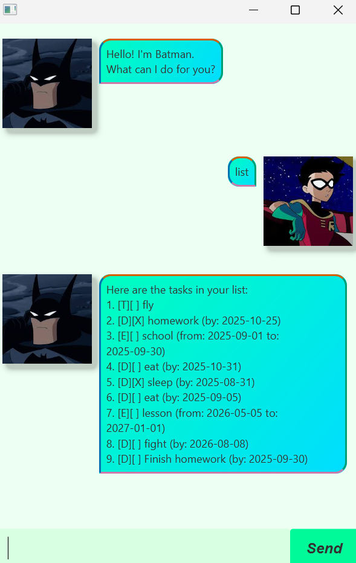

# Batman User Guide



Batman is a task manager chatbot that helps you organize your tasks, set deadlines, and keep track of events. 
With Batman, you can easily add, delete, and snooze tasks, as well as find tasks by keywords.

## Creating to-do tasks

You can create a simple to-do task using the `todo` command.

Example: `todo Buy groceries`

This will create a new to-do task called "Buy groceries."

```
Got it. I've added this task:
[T][ ] Buy groceries
Now you have 10 tasks in the list
```

## Creating deadline tasks

To add a task with a deadline, use the `deadline` command.

Example: `deadline Finish homework /by 2025-09-30`

This will create a task called "Finish homework" with a deadline of September 30, 2025.

```
Got it. I've added this task:
[D][ ] Finish homework (by: 2025-09-30)
Now you have 10 tasks in the list
```

## Event tasks

To create tasks that span over a period (i.e., events), use the `event` command.

Example: `event Team meeting /from 2025-09-30 /to 2025-10-01`

This will create an event called "Team meeting" starting on September 30, 2025, and ending on October 1, 2025.

```
Got it. I've added this task:
[E][ ] Team meeting (from: 30/09/2025 to: 01/10/2025)
Now you have 11 tasks in the list
```

## Marking tasks

You can mark tasks as completed using the `mark` command.

Example: `mark 2`

This will mark the task at index 2 as completed.

```
Nice! I've marked this task as done:
[D][X] Finish homework (by: 2025-09-30)
```

## Unmarking tasks

You can unmark tasks to indicate that they are no longer completed using the `unmark` command.

Example: `unmark 3`

This will unmark the task at index 3, marking it as incomplete again.

```
OK, I've marked this task as not done yet:
[D][ ] Finish homework (by: 2025-09-30)
```

## Deleting tasks

To delete a task from the list, use the `delete` command.

Example: `delete 1`

This will delete the task at index 1.

```
Noted. I've removed this task:
[D][ ] Finish homework (by: 2025-09-30)
Now you have 9 tasks in the list.
```

## Snoozing tasks

You can extend the deadline of a task using the `snooze` command.

Example: `snooze 2 /by 2025-10-15`

This will snooze the task at index 2 to the new deadline of October 15, 2025.

```
Noted. I've snoozed this task:
[D][ ] Finish homework (by: 2025-10-15)
```

## Finding tasks

You can search for tasks using the `find` command with a keyword. This command will return all tasks that contain the keyword in their description.

Example: `find homework`

This will find all tasks containing the word "homework."


```
Here are the matching tasks in your list:
1. [D][X] homework (by: 2025-10-25)
2. [D][ ] Finish homework (by: 2026-01-01)
```

## Formatting dates

You can format the dates of your tasks using the `formatdate` command.

Example: `formatdate dd/MM/yyyy`

This will format the task date to "30/09/2025."

```
Date format changed successfully.
```

## List all tasks

You can list all your tasks using the `list` command.

Example: `list`

This will list all the tasks currently in the list.

```
Here are the tasks in your list:
1. [T][ ] fly
2. [D][X] homework (by: 2025-10-25)
3. [E][ ] school (from: 2025-09-01 to: 2025-09-30)
```

---
For more information or to see all available commands, feel free to ask!